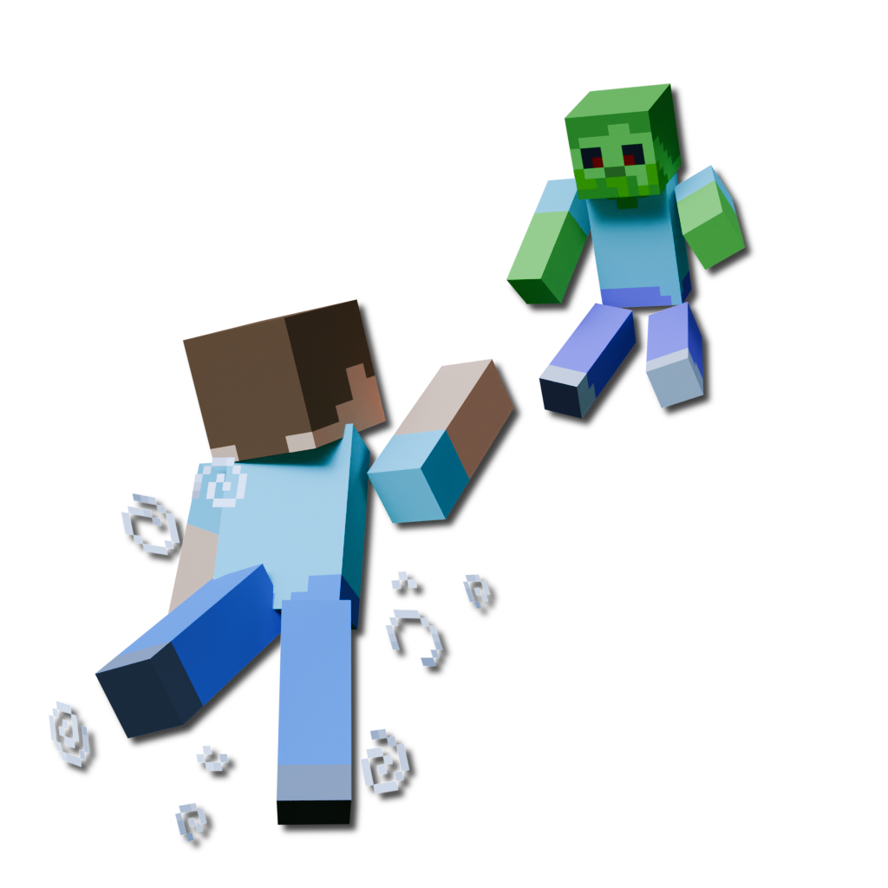

# KineticDamage
A Minecraft mod that scales damage and knockback with kinetic energy.\
*This mod is still in development.*

# Configuration
```properties
# KineticDamage config

# Damage multipliers
# These values will be multiplied with the calculated damage values
damage-multiplier-vertical=1.0
damage-multiplier-horizontal=1.0
                    
# Specify the max amount of damage that can be done
# Negative numbers will uncap the damage
damage-max-vertical=100
damage-max-horizontal=-1.0

# Knockback multipliers
# Scales the knockback with attacker's incoming velocity
knockback-multiplier-x=1.0
knockback-multiplier-y=1.0
knockback-multiplier-z=1.0
                    
# Action multipliers
# Scales damage and knockback depending on the attacker's action
action-sprinting-multiplier=1.0
action-swimming-multiplier=1.0
action-sneaking-multiplier=1.0
action-crawling-multiplier=1.0

# Debug
# Logs debug messages to the chat
debug-chat-log=false
```