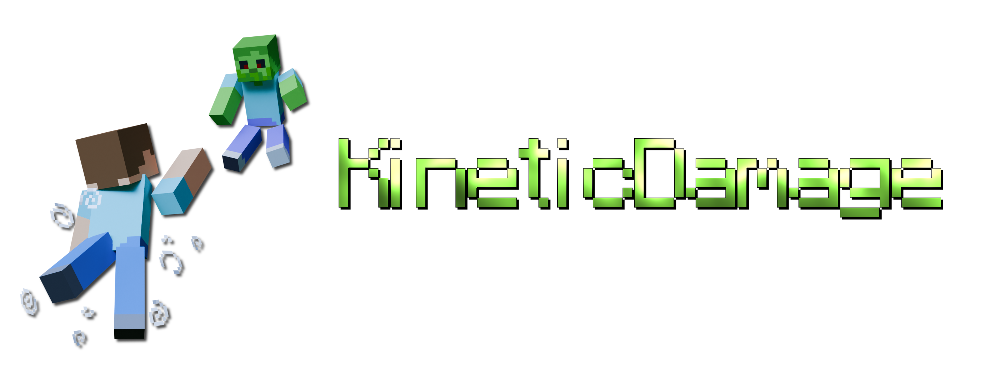
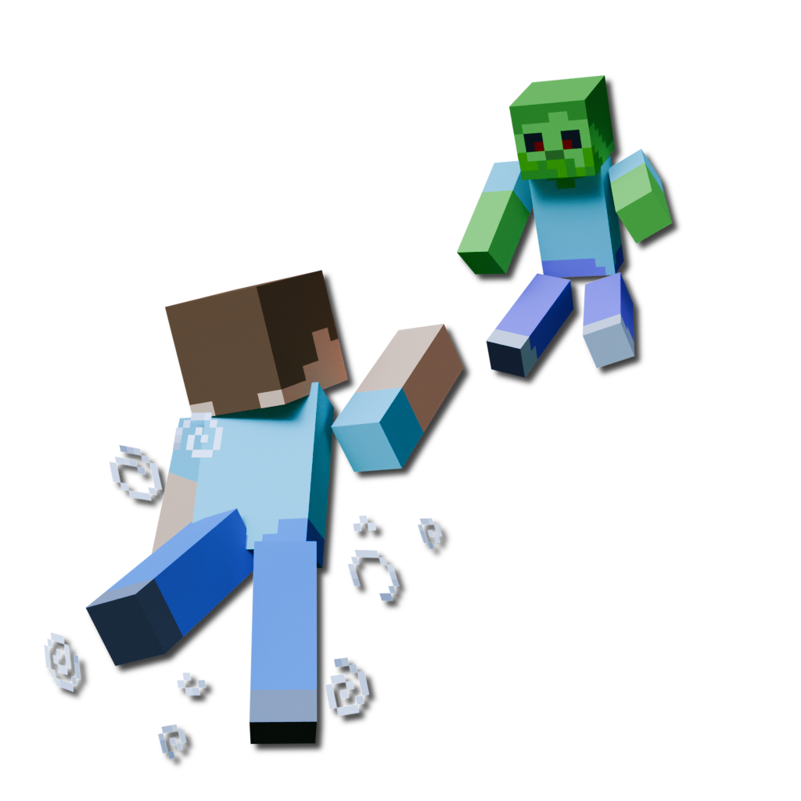

---

# KineticDamage
**An easy-to-use, highly-configurable Minecraft mod that brings more realism to combat by scaling damage and knockback with kinetic energy.**  

***This mod is still in development and lots of new features are still being planned! This is my first ever mod, I hope you find it useful!***  
**If you have a feature request or find a bug please create an [issue](https://github.com/o7q/KineticDamage/issues) or message me on Discord! (username: o7q) 😊**  

---

# ✨ Features

- ## ⚔️ Damage scaling
    ### This mod features a highly configurable damage scaling system that changes how Minecraft deals damage to mobs.
    
    

---

- ## 💨 Knockback scaling
    ### You can also configure how energy is transferred from yourself to other entities.
    

    <br>

    ### Highly compatible with other mods, here are some examples with [**ULTRACRAFT**](https://github.com/absolutelyaya/ultracraft)
    
    

    ### Example with [**BetterCombat**](https://github.com/ZsoltMolnarrr/BetterCombat)
    

    ### Example with an elytra
    

---

# 📜 Commands
- **`/kineticdamage reload` *reloads the config***

That's it! For now... 🙂

---

# ⚙️ Configuration
### This is the default configuration file for KineticDamage. It contains an explanation for every configurable option and acts as the guide.
```properties
# KineticDamage config
# Comment out 'version' with '#' if you do not want the config to regenerate on version change
version=1.0.0_beta1

# Damage multipliers
# These values will be multiplied with the calculated damage values
damage-multiplier-vertical=1.0
damage-multiplier-horizontal=2.0

# Specify the max amount of damage that can be done
# Negative numbers will uncap the damage
damage-max-vertical=50.0
damage-max-horizontal=-1.0

# Knockback multipliers
# Scales the knockback with attacker's incoming velocity
knockback-multiplier-x=2.0
knockback-multiplier-y=1.0
knockback-multiplier-z=2.0

# Action multipliers
# Scales damage and knockback depending on the attacker's action
action-sprinting-multiplier=1.5
action-swimming-multiplier=0.75
action-sneaking-multiplier=0.5
action-crawling-multiplier=0.25

# Use player fall distance for damage
# The farther the player falls the more damage they will do
# Also, this damage will be added on top of the damage already done by the player's velocity
player-use-fall-distance=true

# Use the direct attack register rather than the standard attack callback (calculated client-side using a mixin)
# This option is useful if you are having mod compatibility issues (ex. BetterCombat, or other combat based mods that may interfere with KineticDamage)
# This option should usually be enabled, but in the case you are having issues, try disabling it
player-use-direct-hit-register=true

# Use player head rotation vector for math
# This will use the player's head rotation instead of body velocity to calculate values
# If enabled, the server will always use the players head rotation vector to calculate knockback vectors instead of the velocity vector of the player itself
# In other words, the knockback will always occur in the direction the player is looking, this is not as realistic but it can be very fun
player-use-head-rotation=false

# Should the entity's velocity be completely overwritten by the new calculated velocity?
# By default, the new calculated velocity is added to the entities original velocity, this is much more realistic
# If enabled, all original entity velocity will be ignored and overwritten by the new calculated velocity
entity-ignore-original-velocity=false

# ADVANCED OPTIONS
# Damping function for player fall distance
# This option will make the fall distance damage and knockback scale more slowly the longer the player falls
# This is to make it so a player can't just jump off of a mountain and 1 tap any mob
# I've also included some options to increase the damage the longer you fall (inverse-damping options)
#
# If you don't want to use any damping functions specify: none
# DAMPING OPTIONS (by increasing strength):               linear, sqrt, log_e, log, tanh
# INVERSE-DAMPING OPTIONS (by increasing strength):       quadratic, cubic
# Note: 'none' is the same as 'linear', except that linear will use the coefficient and constant values in it's calculation
player-fall-distance-damping-function=sqrt
# This value is multiplied to the fall distance before going into the damping function, it will be ignored if 'none' is set for the damping function
player-fall-distance-damping-coefficient=10.0
# Horizontal shift factor, example: f(x) = FUNC(AX + K1 <-) + K2
player-fall-distance-damping-constant-1=0.0
# Vertical shift factor, example: f(x) = FUNC(AX + K1) + K2 <-
player-fall-distance-damping-constant-2=0.0
# Auto clamp square root function
# This ensures that the y of f(x) = sqrt(ax) is never bigger than the y of f(x) = ax
# Turning this off can produce strange values when a player crits a mob after falling a small distance
# This value is ONLY used when 'sqrt' is used for the damping function
# When enabled, the 'constant-1' and 'constant-2' values will be ignored
player-fall-distance-damping-sqrt-auto-clamp=true
# This value is multiplied to the fall distance that's used to calculate downwards knockback
# Lower values means lower downwards knockback
player-fall-distance-downwards-knockback-coefficient=0.05

# Debug
# Logs debug messages to the chat (per player)
debug-chat-log=false
```

---

**🥰 The idea and name for this mod came from my friend [**weeg**](https://github.com/weegb).**

---



**KineticDamage**\
Written in Java for Minecraft Fabric

<span style="font-size: 100px">test</span>
